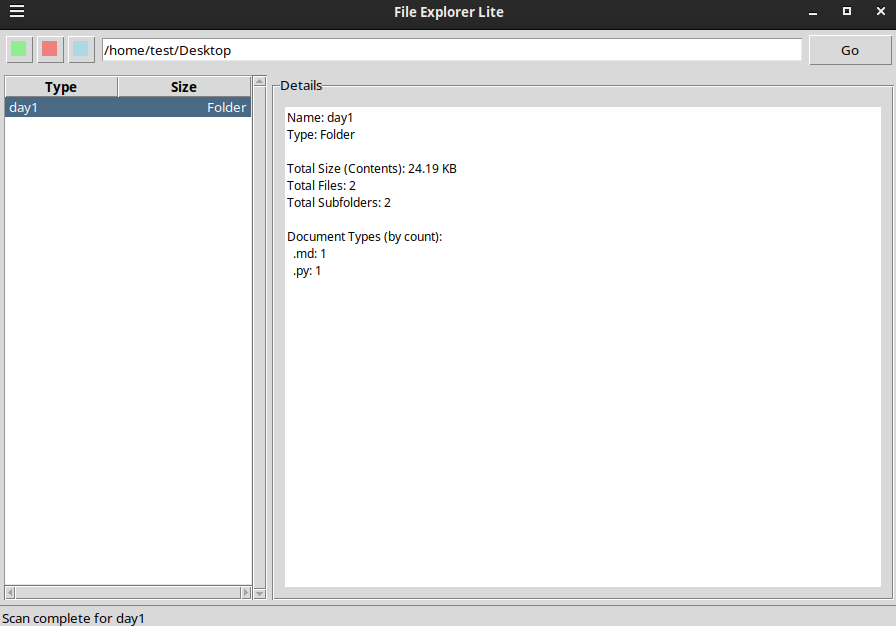

# File Explorer Lite

Navigate directories, view file info. (Python/Tkinter)



File Explorer Lite is a lightweight, cross-platform graphical file explorer built with Python and Tkinter. It allows users to browse their file system, view details about files, and get comprehensive statistics for folders, including recursive counts of files, subfolders, total size, and a breakdown of document types.

## ✨ Features

*   **Intuitive Directory Navigation:**
    *   Back, Forward, and Up buttons.
    *   Address bar for direct path entry and "Go" button.
    *   Double-click to enter folders.
*   **File & Folder Listing:**
    *   Clear `TreeView` display of current directory contents.
    *   Shows item name, type (extension or "Folder"), and size (for files).
    *   Sorts folders before files for better organization.
*   **Detailed Information Pane:**
    *   **For Files:** Displays name, type, and size (human-readable and exact bytes).
    *   **For Folders (Recursive Scan):**
        *   Name of the selected folder.
        *   Total size of all contents within the folder and its subfolders.
        *   Total number of files.
        *   Total number of subfolders.
        *   Breakdown of document types by count (e.g., `.txt: 5`, `.py: 3`, `.jpg: 10`).
*   **Responsive UI:** Folder scanning (which can be intensive) is performed in a background thread to keep the graphical user interface (GUI) responsive.
*   **Status Bar:** Provides feedback on current operations (e.g., "Loading...", "Scanning...", "Ready", "Error...").
*   **Basic Error Handling:** Manages inaccessible paths and provides user feedback.

## 🛠️ Requirements

*   Python 3.x
*   Tkinter (usually included with Python standard installations on most platforms. If not, you may need to install it, e.g., `sudo apt-get install python3-tk` on Debian/Ubuntu).

## 🚀 Getting Started

1.  **Clone the repository (or download the `app.py` file):**
    ```bash
    git clone https://github.com/azario0/file-explorer-lite.git
    cd file-explorer-lite
    ```
2.  **Navigate to the project directory:**
    ```bash
    cd /path/to/your/downloaded/or/cloned/folder
    ```

3.  **Run the application:**
    ```bash
    python app.py
    ```

## 📖 How to Use

1.  **Launch the application** as described in "Getting Started".
2.  **Navigate Directories:**
    *   Use the **Back (←)**, **Forward (→)**, and **Up (↑)** buttons on the toolbar.
    *   Type a valid directory path into the **address bar** at the top and press `Enter` or click the **"Go"** button.
    *   **Double-click a folder** in the main list view (left pane) to enter it.
3.  **View Information:**
    *   **Single-click** on a file or folder in the list on the left.
    *   Details about the selected item will appear in the **"Details" pane** on the right.
    *   **For files:** Name, Type, and Size will be shown.
    *   **For folders:** A scan of its contents will begin. The "Details" pane will update with total size, file count, subfolder count, and a breakdown of document types once the scan is complete. A "Scanning..." message will be displayed in the info pane and status bar during this process.

## ⚙️ How It Works (Briefly)

*   **GUI:** The application's graphical user interface is built using Python's built-in `tkinter` library, with `tkinter.ttk` for more modern-themed widgets.
*   **File System Interaction:** The `os` module is used for all file system operations like listing directory contents (`os.listdir()`), checking paths (`os.path.isdir()`, `os.path.isfile()`), getting file sizes (`os.path.getsize()`), and recursively walking through directory trees (`os.walk()`).
*   **Responsiveness (Threading):** To prevent the GUI from freezing during potentially long-running folder scans, the recursive scanning logic (`_scan_folder_worker`) is executed in a separate background thread using the `threading` module.
*   **Thread-Safe Communication:** A `queue.Queue` is used to safely pass the results of the folder scan (or any errors encountered) from the background thread back to the main GUI thread, which then updates the "Details" pane. The main thread periodically checks this queue using `root.after()`.

## 💡 Potential Future Improvements / To-Do

*   [ ] **Enhanced Icons:** Integrate a library like `Pillow` to display actual file type icons (e.g., PNGs for different document types) instead of generic placeholders.
*   [ ] **Custom Styling/Themes:** Explore `ttkthemes` or manual theme creation for a more polished visual appearance.
*   [ ] **Context Menus:** Add right-click context menus for common file operations (e.g., Open, Copy Path, Delete - with caution!).
*   [ ] **File Operations:** Implement basic file operations like copy, paste, delete, rename (would require significant additions and safety checks).
*   [ ] **Progress Bar:** Display a visual progress bar during lengthy folder scans.
*   [ ] **Search/Filter:** Add functionality to search for files/folders within the current view or recursively.
*   [ ] **Settings/Configuration:** Allow users to configure preferences (e.g., show/hide hidden files, default starting directory).
*   [ ] **Packaging:** Create standalone executables for different operating systems (e.g., using PyInstaller or cx_Freeze).

## 🤝 Contributing

Contributions, issues, and feature requests are welcome! Feel free to check [issues page](https://github.com/your-username/file-explorer-lite/issues) if you want to contribute.

1.  Fork the Project
2.  Create your Feature Branch (`git checkout -b feature/AmazingFeature`)
3.  Commit your Changes (`git commit -m 'Add some AmazingFeature'`)
4.  Push to the Branch (`git push origin feature/AmazingFeature`)
5.  Open a Pull Request

## 📄 License

Distributed under the MIT License. See `LICENSE.txt` for more information.
*(You should create a `LICENSE.txt` file in your repository containing the MIT License text if you choose this license.)*

---

